### Multi-agent AI & GPU systems for wireless — and the same toolkit applied to markets

PhD candidate at **National Taipei University of Technology** working on **multi-agent deep reinforcement learning** for UAV-assisted networks, **reconfigurable intelligent surfaces (RIS)**, and **space-air-ground integrated networks (SAGIN)** — with a hands-on focus on **GPU-accelerated PHY** (CUDA, cuSolver/cuBLAS, NVIDIA Sionna). I also apply the same RL/ML toolkit to **systematic trading**: regime detection, risk control, and production ML. 🏆 4.00 / 4.00 GPA

---

### 🛠 Tech stack

**Specialty domains:** OFDM PHY · MIMO · LDPC · 5G NR · RIS · O-RAN · Federated Learning · MADDPG · PPO · CUDA kernels · Systematic trading

---

## 🛰 AI-native wireless & 6G

#### 🚀 [gpu-accelerated-ai-ran-phy-lab](https://github.com/kabNath/gpu-accelerated-ai-ran-phy-lab) 
End-to-end OFDM PHY + AI-RAN stack where every claim is runnable. Real **CUDA C++** MMSE channel estimation (custom kernel + **cuSolver** `Cpotrf`/`Cpotrs` + **cuBLAS** `Cgemm`), a **Sionna** 5G LDPC + TR38.901 TDL BLER link, and link adaptation (OLLA / model-based greedy / model-free learned policy) driven by the *measured* BLER curves.
**Result:** **133× vs NumPy** on an RTX 4090 (verified to ~1e-4 vs a CPU reference) · model-free policy matches a tuned OLLA / greedy from ACK/NACK feedback alone, at the lowest BLER · figures, green CI, and a `NVIDIA_REVIEW.md` design/verification guide

#### ⚡ [cuda-phy-channel-estimation](https://github.com/kabNath/cuda-phy-channel-estimation)
A CUDA kernel-optimization case study on the MMSE-apply complex GEMM: **naive → shared-memory tiled → cuBLAS**, benchmarked on an RTX 4090, with an Nsight Compute profiling methodology. Keeps a NumPy/CuPy reference and checks correctness against a CPU baseline.
**Result:** clean naive→tiled→cuBLAS performance breakdown · GPU == CPU to ~1e-4 · CUDA compile-checked in CI · the GPU-kernel companion to the flagship

#### 🤖 [sionna-link-adaptation-drl](https://github.com/kabNath/sionna-link-adaptation-drl)
Standalone deep-RL study for 5G NR link adaptation: self-contained **PyTorch PPO** vs an **OLLA** industry baseline, 28-index MCS table (3GPP TS 38.214), non-stationary SNR with mobility/handover scenarios.
**Result:** PPO learns a competitive policy from scratch (~3 min CPU training), evaluated fairly head-to-head vs OLLA · 15/15 unit tests

#### 🔐 [federated-csi-feedback](https://github.com/kabNath/federated-csi-feedback)
Federated learning for CSI feedback compression: CsiNet autoencoder + FedAvg under non-IID channel statistics, aligned with the 3GPP Release 18 AI-RAN study item.
**Result:** FedAvg matches centralised (~−2 dB NMSE) and beats local-only by ~2 dB · 16/16 unit tests

#### 🚧 In active development
- `ris-beamforming-optimizer` — RIS phase optimization (manifold + deep-learning methods)
- `oran-resource-allocation-xapp` — O-RAN xApp-style resource scheduling with DRL

---

## 📈 Systematic trading & quantitative ML

#### 🧭 [market-regime-engine](https://github.com/kabNath/market-regime-engine)
Regime detection, risk allocation and live health monitoring — the open-sourced **production layer** of a systematic book. Six-indicator regime classifier (BULL/NEUTRAL/BEAR/CRISIS) with hard crisis gates, inverse-volatility weighting with portfolio vol targeting, and a monitoring battery with a trailing-drawdown kill-switch.
**Result:** explainable-by-construction regime calls · fail-safe `tradeable` flag for automated halts · 9/9 unit tests · CI

#### 💼 [AI-Capital](https://github.com/kabNath/AI-Capital) *(public sample — full system private)*
Multi-asset systematic trading system on QuantConnect: cross-asset momentum, regime detection, volatility targeting and crisis routing, iterated through 11+ versions under strict out-of-sample validation with bias auditing (look-ahead, weight-cap, vol-estimation pitfalls).
**Status:** active paper-trading track record · public repo contains a representative architecture sample

#### 🔬 Alpha research — WorldQuant BRAIN
Systematic factor research on a professional simulation platform; first passing alpha cleared the platform's evaluation thresholds.

---

### 📊 Research output

**8+ IEEE publications** in AI-native wireless networks:
- Hybrid federated learning with MADDPG for UAV-assisted access networks
- Reconfigurable intelligent surface optimization for 6G
- SAGIN architectures with LEO (Starlink) integration
- Channel estimation and beamforming for next-gen PHY

🔗 [ORCID](https://orcid.org/0009-0006-8255-8711)

---

### 🏛 Affiliations

- 🎓 **PhD candidate**, National Taipei University of Technology — 4.00 / 4.00 GPA
- 🟢 **NVIDIA NGC 6G Developer Program** — Member, 2026 cohort
- 👨‍🏫 **Advisors:** Prof. Hsin-Piao Lin · Assoc. Prof. Rong-Terng Juang

---

### 🌐 Connect

📧 [Email](mailto:nooptanio2007@gmail.com) · 💼 [LinkedIn](https://www.linkedin.com/in/wendenda-nathanael-kabore-87b7b3272/) · 🎓 [ORCID](https://orcid.org/0009-0006-8255-8711)
📍 Taipei, Taiwan · 🇫🇷 🇬🇧 🇹🇼

---

<b>📊 GitHub stats</b>

